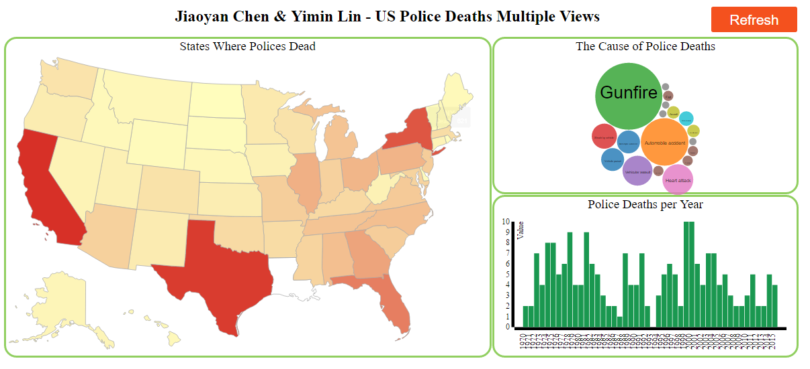
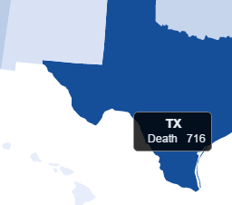
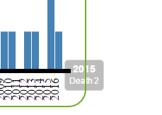
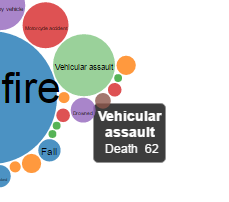
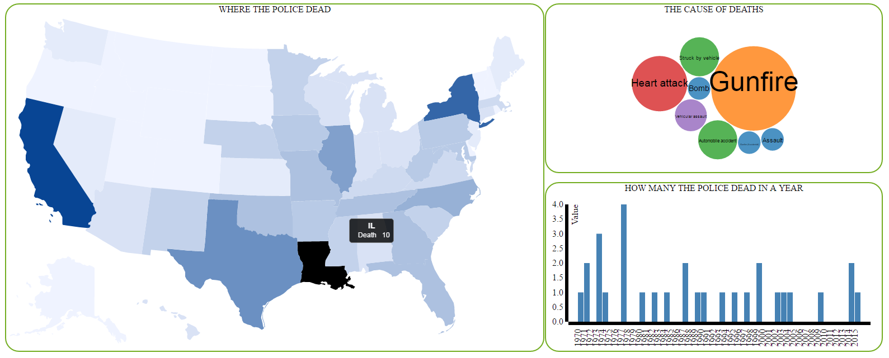

Assignment 4 - Visualizations and Multiple Views  
===

- Link: https://yiminlin1994.github.io/04-MapsAndViews/

## Team members

- Yimin Lin, yiminlin1994, is responsible for building the police-death-map, the link of map with another two charts and mouse hover labels.

- Jiaoyan Chen, kaito4213, is responsible for build the bubble chart, bar chart, the link of charts and readme documentation.

We forked the Police Deaths data from github. The primary source of data is the Officer Down Memorial Page (ODMP), started in 1996 by a college student who is now a police officer and who continues to maintain the database. We cleaned the dataset and removed some unnecessary information for this assignment.
The map shows where the police were dead, the locations were divided by state. We used luminance to represent the accumulation amout of how many policemen dead in the state.
The bubble chart visualizes how the police dead. Each bubble shows one of the cause, the size was mapped to the amount of deaths.
The bar chart shows how many policemen dead in the past 46 years. The range of y axis will change according to the map and bubble chart.
Here is the overview of our assignment:

We cannot find any police deaths record in Louisiana, so the area is shown in white here.

When you mouse hover any one of these charts, you will see the label with detailed information that how many policemen death in this state and in this year and why they dead.

     

The cool idea about our assignment is any two charts can response to the click event on another one. User can filter the data by location, year and cause. Here is the visualization responsing to filtered data:

## Technical achievements

- Programming in function structure to make it easier to modify.

- Dynamic data generated when clicking on chart and passed as parameter to another two charts.

- Linked views among map, bubble chart and bar chart.

- Changable range of Y axis according to the filtered data.

- Using d3.dispatch event to initiate the chart.

## Design achievements

- Choropleth map visualizes the amount of deaths in that state.

- Lable shows up when mouse hover.

- Adjustable front size of bubble chart to avoid the text overlap.

## Resources
Dataset: https://github.com/fivethirtyeight/data/tree/master/police-deaths

Bubble Chart: https://bl.ocks.org/mbostock/4063269

Color: http://colorbrewer2.org/#type=diverging&scheme=RdYlGn&n=7

Button: https://www.w3schools.com/css/tryit.asp?filename=trycss_buttons_animate1

Map: https://gist.github.com/NPashaP/a74faf20b492ad377312
