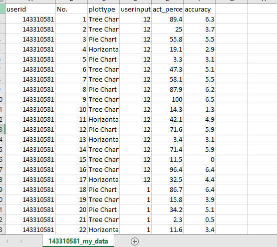

Assignment 3 - Replicating a Classic Experiment  
===

- Link: https://yiminlin1994.github.io/03-Experiment/

## Team members

- Yimin Lin, YiminLin1994, responsible for build the bar chart, pie chart, progress number, start page, the experiment design including input, button, random chart refresh, data record and output, readme of experiment part.

- Jiaoyan Chen, kaito4213, responsible for build the tree chart, progress bar, end page and csv file form rebuild, output analysis and analysis part of readme.

---

## Screenshot

At first, users would be informed some basic information on the webpage, which provides some brief introduction. Click the 'Start' button, users will be guided to the experiment page. To avoid noise, all of these three kinds of charts own two axis.  Animation for Input and Button are also Applied. What's more, we also applied progress bar and progress number to make it more user friendly.

There are three visualizations including Tree Chart, Pie Chart and Horizontal Bar Chart. Each of them will be showed for 20 times in a random sequence.

To avoid improper input, two kinds of alert are applied here.

After users finished all the trials, an csv file would be automatically downloaded and users could see a thank you page. The accuracy is adjusted by "Log-base-2", which indeed is the normalized error.

## Hypotheses
In this experiment, we have two hypotheses.

1.Bar chart works better than pie chart and pie chart works better than tree chart to make people percept difference.

2.People can percept the difference better when small value is about 1/3 to 2/3 of the larger value. If percentage is lower than 1/3 or higher than 2/3, people's perception result would be worse.

## Analysis
First, we worked on Hyposis1 both using Bootstrapped 95\% confidence intervals for error upper and lower bounds and not.The result is like:
i
First, we worked on Hyposis1 both using Bootstrapped 95\% confidence intervals for error upper and lower bounds and not.The result is like:
original error boxplot

using bootstrap

As we can see from the figure, the bar chart had the lowest error followed by tree chart, pie chart did the worst work. But the pie chart had narrower confidence interval.

We supposed that if percentage is lower than 1/3 or higher than 2/3, people's perception result would be worse. But the result shows that happens in the totally opposite way. People had better precision when given the actual percent lower than 1/3 and more than 2/3.

## Technical achievements

- Programming in function structure to make it easier to modify.

- Create two static axis to reduce noise

- Using combination of hour/minute/second/millisecond to create a unique user id.

- Create a csv file name by user id so that users could send it to us.

- Create a shuffle function to shuffle the sequence of charts, which reduces the noise.

## Design achievements

- Add animation for input and button to make it more funny for users to click.

- Add a placeholder in input to guide users to input right value.

- Add progress bar and progress number for the trial to make users easier to know how far they've gone and how many trial they need to finish.

- For bar chart we put the point at the bottom rather then the middle in order to reduce noise because the middle point might help users to percept the difference easier.
