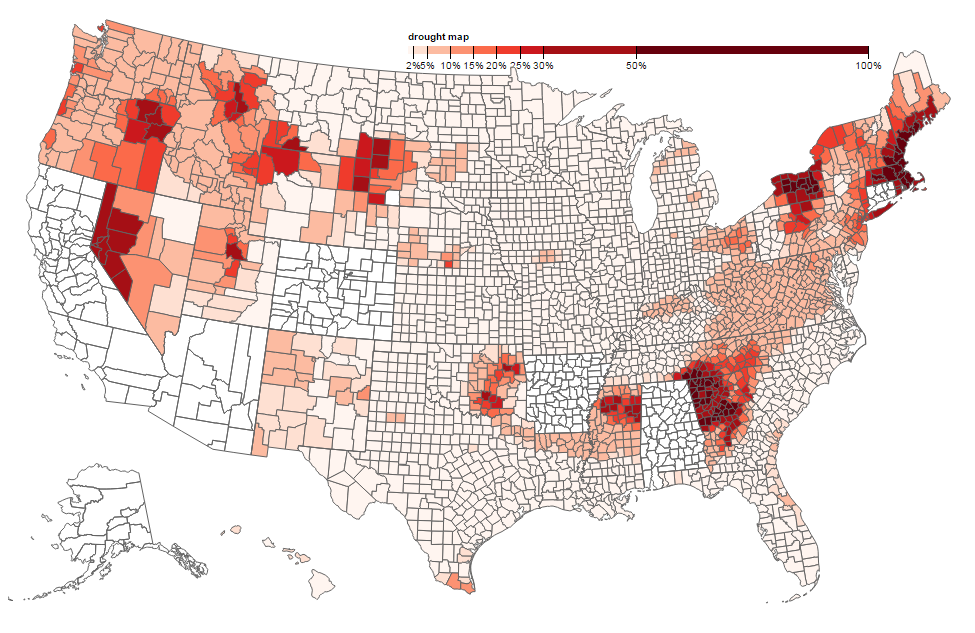

# Lab -- Maps

Team:

- Jiaoyan Chen
- Yujun Tian

## Introduction 
https://kaito4213.github.io/data-visualization/

We achieve this map on the basis of the map of unemployment rate in U.S. Red related color is great choice to present the concept of drought. To represent the drought data, we choose schemaReds to present the order of drought. Darker color shows in that area, the drought problem is more serious. Red related color is great choice to present the concept of drought. Besides, to make the border of county visible, we added and modified the "stroke" attribute in the css part. 

When we dealt with the drought data, the D0, D1, D2 columns represent the severity of drought. So to plot the attributes on the map, we applied different powers to the D0, D1, D2, D3, D4 attributes and scaled it to 0 to 100. So the final drought rate = (1*D1+2*D1+3*D2+4*D3+5*D4)/15, then we plot the final drought rate on the map and represent it by color code.

