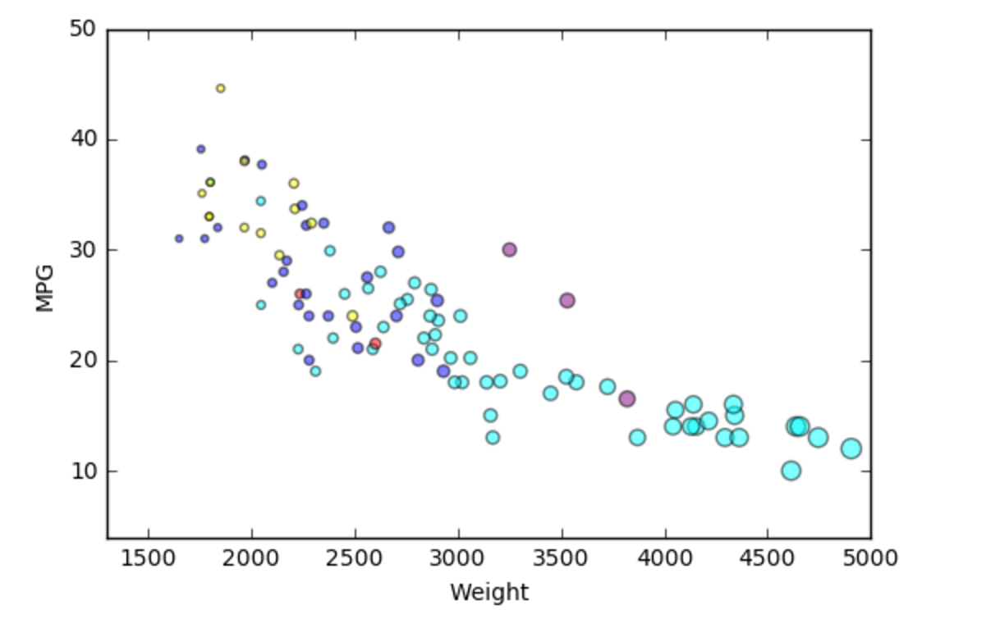
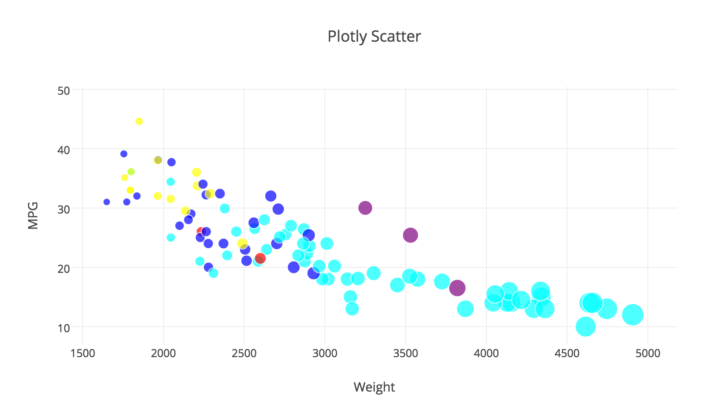
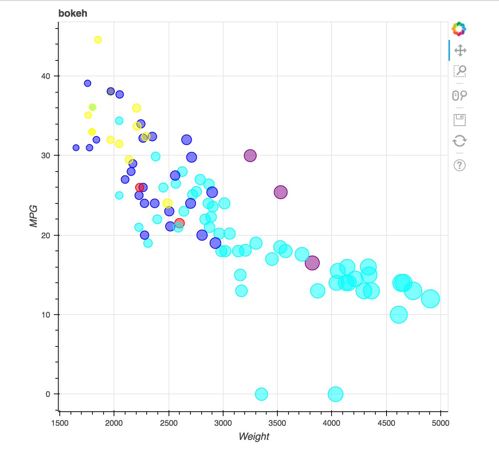
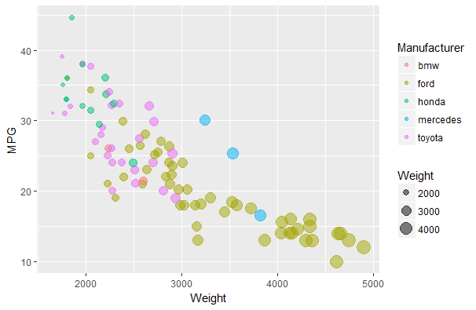
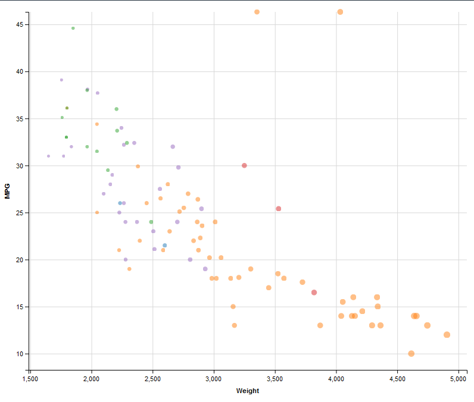
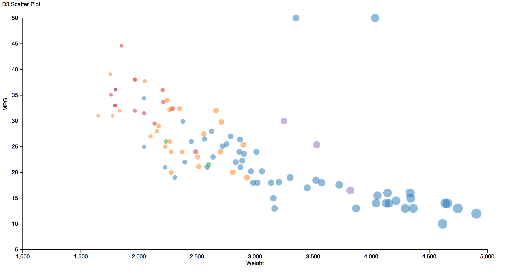
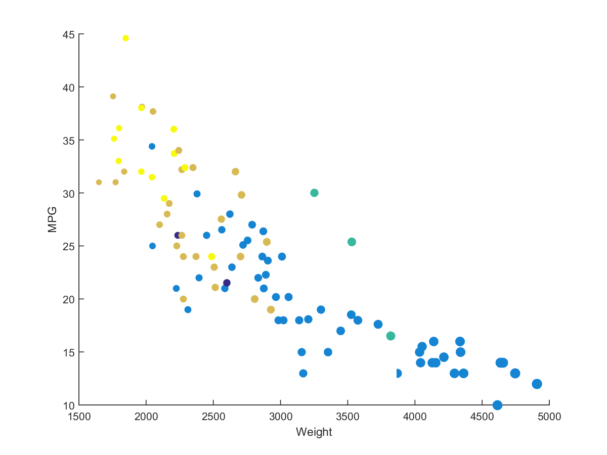
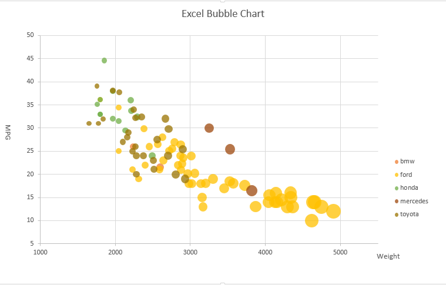
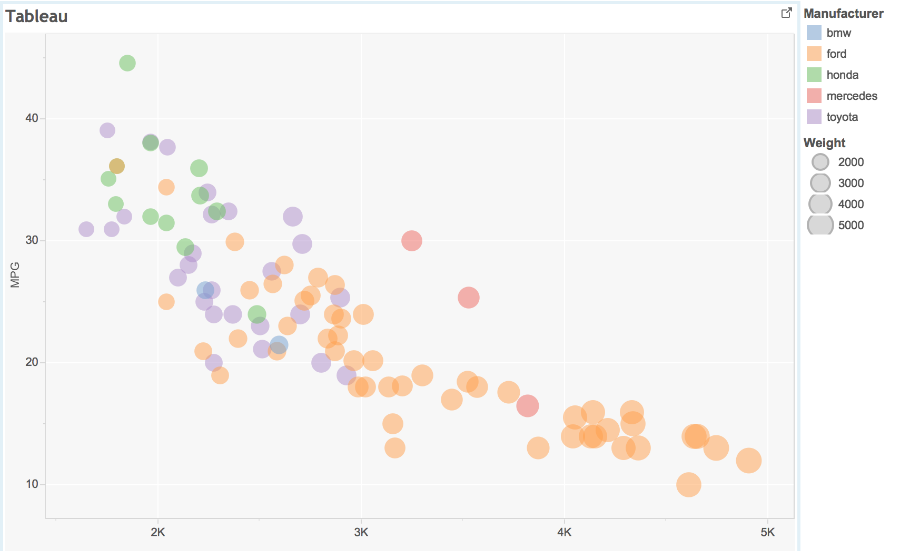

# 02-DataVis-10ways

### Overview of 10 ways

|    | Language  | Package    | Difficulty | Flexibility |
|----|-----------|------------|:----------:|:-----------:|
| 1  | Python    | matplotlib | easy       | medium      |
| 2  | Python    | plotly     | easy       | medium      |
| 3  | Python    | bokeh      | easy       | medium      |
| 4  | R         | ggplot2    | super easy | low         |
| 5  | R         | ggvis      | super easy | low         |
| 6  | JavaScript| D3         | medium     | high        |
| 7  | Matlab    | none       | easy       | medium      |
| 8  | JAVA      | 2D         | medium     | high        |
| 9  | Excel     | none       | easy       | low         |
| 10 | Tableau   | none       | super easy | low         |

 
# Python + Matplotlib
Matplotlib is a popular plotting package in the python library and can be used in many cases. It's documentation is the one of the best I have ever seen. Pyplot provides the state-machine interface to the underlying plotting library in matplotlib. I use pyplot.scatter() to visualize the dataset. It is convenient that figures and axes are implicitly and automatically created to achieve the desired plot. So I don't have to draw it manufacturally. Though it is popular, the figure looks a bit clumsy. 

# Python + Plotly
Plotly is an online analytics and data visualization tool that provides online graphing. Moreover, Plotly plots are interactive, meaning you can manually explore the data by panning, selecting, zooming on the graphing surface. I like the feature that I can see the detail information by moving the mouse to the dots. 

The official documentation provides good tutorials. I use plotly.iplot() to visualize the dataset.Before plot the data, I have to change the origin dataset into key-value pairs. So I think maybe it is good tool to visualize data stored in json.

# Python + bokeh
Bokeh is a Python interactive visualization library that targets modern web browsers for presentation. Its goal is to provide elegant, concise construction of novel graphics in the style of D3.js. I think it is 
a quick and easy way to create interactive plots. Just like the Plotly, one can see the detail information by moving the mouse to the dots. And the figure looks really nice.

# R + ggplot2 
R is a language primarily focused on statistical computing. ggplot2 is a popular library for charting in R. It is quite convenient because I don't have to deal with the data structure. The imported data file can be used directly. Besides, it plots legends automatically. 

# R + ggvis
ggvis is another library in R and has similar under underlying theory to ggplot2. But it's expressed a little differently, and add new features to make the plots interactive. It's easy to use, the legends, labels are added automatically.

# JavaScript + D3
I have to say that it really took a lot of time for me to figure it out with D3. The blog [here](http://bl.ocks.org/weiglemc/6185069) is quite helpful for a beginner. In D3, I have to do almost everything manufacturally. The position and stylying things took the most time. The good thing of D3 is that it's quite flexible that I can put the elements wherever I want it. It can be used in some complicated situations while R and Python cannot make it in the future projects.

When I ran my code, it confused me that some functions can be excuted in v3 but cannot be recognized in v4. Finally I decided to use v3.

To succesdfully excute the html file, local server is necessary. I used node js here.

# Matlab
It's a powerful tool to make the computation of matrix. But the data structure in matlab is a little different from other language I'm familiar with. The indexing of cells and tables also confused me. As long as I figured it out how to deal with the raw data, it quite simple to plot the data.

# JAVA + Graphics2D
JAVA is not a powerful tool to plot the data as Python, R and others. It doesn't have the packaging method to generate the scatter plot. So I do everything from scratch, plotting the circle one by one. It took much time to computer the position for the axis, label and lengend. Doing such thing is quite boring, I hope I never used that. As you can see from the below, the dot looks weird.

# Excel
The scatter plot is called bubble chart in Excel. It is not easy as I thought. The good thing is I don't have to make the data processing like transforming the data structure. The challenge I found in this way is adjusting the size of each dot. I followed the trick [here](https://www.extendoffice.com/documents/excel/2345-excel-change-bubble-size.html).
Anyway, there are so many restrictions when using Excel, it cannot be used in complex cases reqiring interactions.

# Tableau
This is the most efficient way among all these 10 ways. I just open the csv file and click the mouse, then all thing down. Maybe the most time consuming part is downloading the application. It is interactive and I can see the tooltip with the mouse hover. After all, it is a hot product in BI market.

